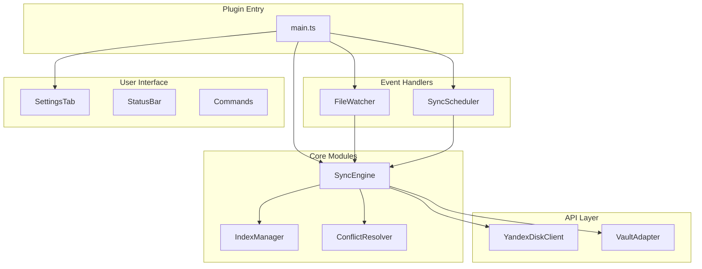
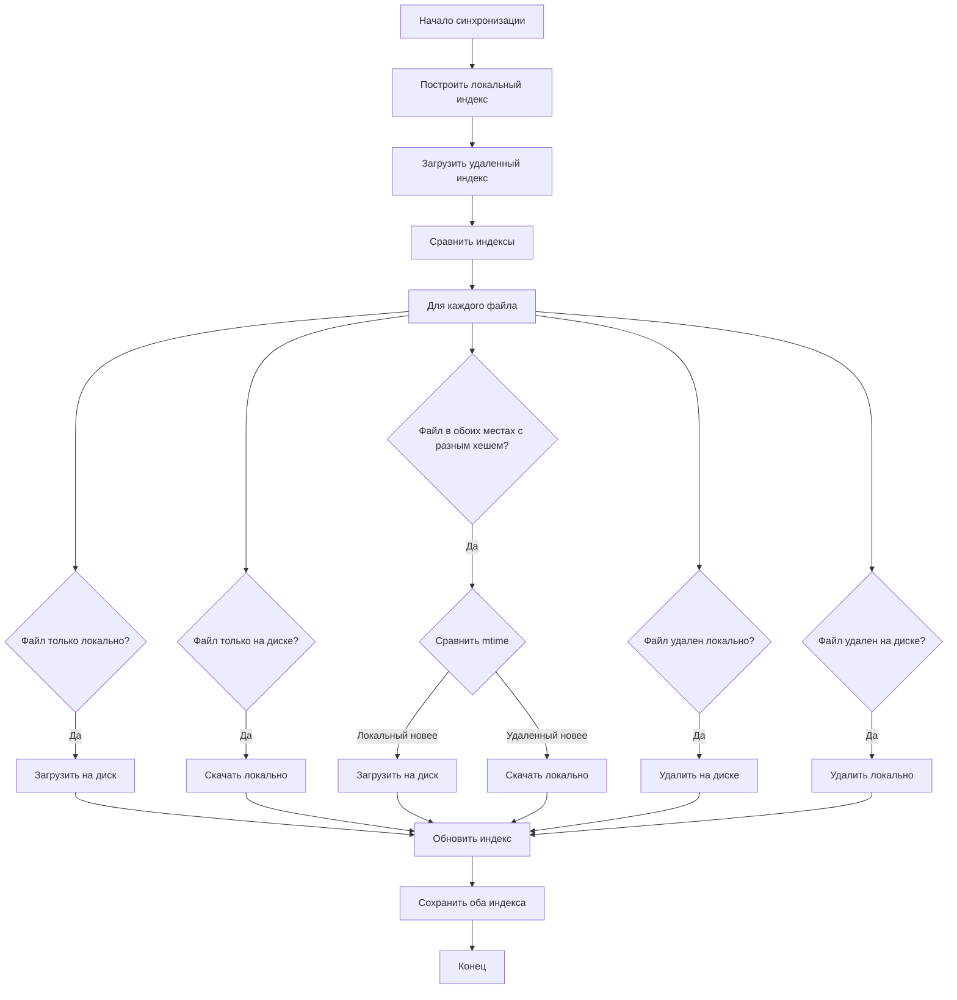
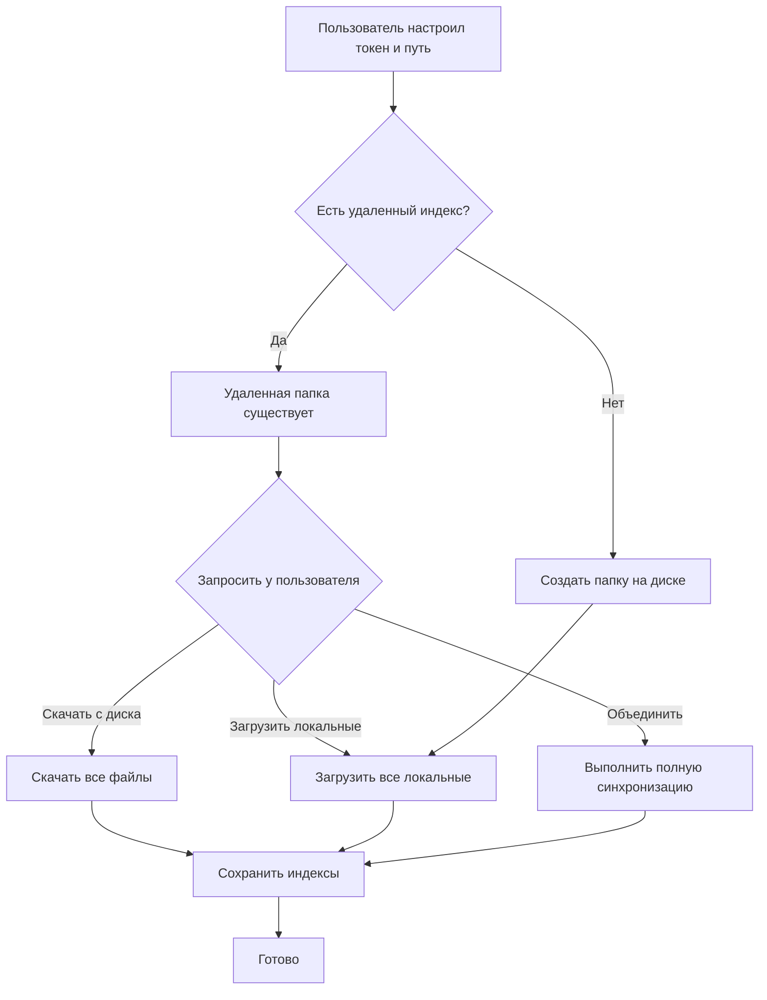

# План реализации плагина Yandex Disk Sync

## Общая архитектура



## Структура проекта

```
src/
  main.ts                    # Точка входа плагина
  settings.ts                # Настройки и Settings Tab
  types.ts                   # TypeScript интерфейсы

  api/
    yandex-client.ts         # HTTP клиент для Yandex Disk API
    vault-adapter.ts         # Адаптер для работы с Vault

  sync/
    sync-engine.ts           # Основной движок синхронизации
    index-manager.ts         # Управление индексом файлов
    conflict-resolver.ts     # Разрешение конфликтов
    file-watcher.ts          # Отслеживание изменений файлов
    sync-scheduler.ts        # Планировщик синхронизации

  ui/
    status-bar.ts            # Индикатор статуса в статус-баре
    init-modal.ts            # Модальные окна синхронизации

  utils/
    path-utils.ts            # Утилиты для работы с путями
    hash-utils.ts            # Вычисление хешей файлов (SHA256)
    logger.ts                # Логирование
```

---

## Модуль 1: Настройки плагина (src/settings.ts)

**Параметры настроек:**

-   `yandexTokenSecret: string` - OAuth токен Yandex Disk
-   `remotePath: string` - Путь к папке на Яндекс Диске (например, `obsidian-sync/my-vault`)
-   `syncInterval: number` - Интервал автосинхронизации в минутах (0 = отключено)
-   `enableRealtimeSync: boolean` - Включить реал-тайм синхронизацию
-   `syncPatterns: string[]` - Паттерны для включения (например, `["**/*.md", "attachments/**"]`)
-   `excludePatterns: string[]` - Паттерны для исключения (например, `[".obsidian/workspace*"]`)
-   `syncDotObsidian: boolean` - Синхронизировать папку .obsidian
-   `deviceId: string` - Уникальный ID устройства
-   `debounceDelay: number` - Задержка debounce в мс

---

## Модуль 2: Yandex Disk API клиент (src/api/yandex-client.ts)

**Методы:**

-   `getResource(path)` - Получить метаданные файла/папки
-   `getResourcesRecursive(path)` - Рекурсивно получить все файлы в папке
-   `uploadFile(remotePath, content)` - Загрузить файл
-   `downloadFile(remotePath)` - Скачать файл
-   `deleteResource(path)` - Удалить файл/папку
-   `createFolder(path)` - Создать папку
-   `moveResource(from, to)` - Переместить/переименовать ресурс

**Особенности:**

-   Загрузка через двухшаговый процесс: получить upload URL, затем PUT содержимое
-   Обработка пагинации для больших директорий (limit/offset)
-   Retry логика с exponential backoff для ошибок 429/503
-   Rate limiting для предотвращения блокировки

---

## Модуль 3: Индекс синхронизации (src/sync/index-manager.ts)

**Структура индекса:**

```typescript
interface SyncIndex {
	version: number;
	lastSyncTime: number;
	deviceId: string;
	files: Record<string, FileMetadata>;
}

interface FileMetadata {
	path: string;
	sha256: string; // SHA256 хеш (совместимо с Yandex Disk API)
	size: number;
	mtime: number; // Время модификации
	syncedAt: number; // Время последней синхронизации
	deleted?: boolean; // Флаг мягкого удаления
	deletedAt?: number;
}
```

**Два индекса:**

-   Локальный индекс: хранится в `data.json` плагина
-   Удаленный индекс: файл `.obsidian-sync-index.json` в целевой папке на диске

**Методы:**

-   `buildLocalIndex()` - Сканирование vault и построение индекса
-   `loadRemoteIndex()` - Загрузка индекса с Яндекс Диска
-   `saveRemoteIndex()` - Сохранение индекса на Яндекс Диск
-   `getRemoteFiles()` - Получение списка файлов с диска

---

## Модуль 4: Движок синхронизации (src/sync/sync-engine.ts)

### Алгоритм полной синхронизации



### Логика определения действий

| Локальный индекс | Удаленный индекс | Локальный файл | Удаленный файл | Действие                              |
| ---------------- | ---------------- | -------------- | -------------- | ------------------------------------- |
| Есть             | Нет              | Есть           | Нет            | Upload                                |
| Нет              | Есть             | Нет            | Есть           | Download                              |
| Есть             | Есть             | Есть, новее    | Есть           | Upload                                |
| Есть             | Есть             | Есть           | Есть, новее    | Download                              |
| Есть (deleted)   | Есть             | Нет            | Есть           | Delete remote                         |
| Есть             | Есть (deleted)   | Есть           | Нет            | Delete local                          |
| Нет              | Нет              | Есть           | Нет            | Upload (новый файл)                   |
| Нет              | Нет              | Нет            | Есть           | Download (новый на другом устройстве) |

---

## Модуль 5: Реал-тайм синхронизация (src/sync/file-watcher.ts)

**Подписка на события Vault:**

-   `vault.on('create')` - Создание файла -> Upload
-   `vault.on('modify')` - Изменение файла -> Upload (с debounce)
-   `vault.on('delete')` - Удаление файла -> Delete remote
-   `vault.on('rename')` - Переименование -> Move на диске

**Debouncing:**

-   Задержка 2-3 секунды после последнего изменения перед загрузкой
-   Предотвращает множественные загрузки при быстром наборе текста

---

## Модуль 6: Сценарий инициализации

### Первичная настройка (пустой vault -> заполненный диск)



---

## Модуль 7: Конфигурация сборки

Файл `esbuild.config.mjs`:

-   Выходная папка: `build/`
-   Копирование артефактов в `/Users/swnet/Desktop/obsidian-test-vault/.obsidian/plugins/yandex-sync-new/`
-   Файлы: `main.js`, `manifest.json`, `styles.css`

---

## Команды плагина

1. **Синхронизировать сейчас** (`sync-now`) - Принудительная полная синхронизация
2. **Приостановить/возобновить** (`toggle-sync`) - Приостановить/возобновить синхронизацию
3. **Показать статус** (`show-status`) - Показать статус и последние операции
4. **Скачать все с диска** (`force-download`) - Принудительное скачивание
5. **Загрузить все на диск** (`force-upload`) - Принудительная загрузка

---

## Обработка Edge Cases

1. **Конфликт времени**: Если mtime одинаковый - сравнить SHA256, если хеш разный - создать conflict копию
2. **Большие файлы**: Показывать прогресс загрузки/скачивания в статус-баре
3. **Офлайн режим**: Синхронизация запускается только при наличии сети
4. **Device ID**: Генерируется уникальный ID устройства для отслеживания источника изменений
5. **Debounce**: Задержка перед синхронизацией для предотвращения частых загрузок

---

## Безопасность

-   Токен хранится в настройках плагина (можно использовать SecretStorage в будущем)
-   Не логируется токен и содержимое файлов
-   Валидация путей для предотвращения path traversal

---

## Статус реализации

-   [x] Настройка сборки (esbuild)
-   [x] TypeScript интерфейсы и типы
-   [x] Настройки плагина
-   [x] Yandex Disk API клиент
-   [x] Vault адаптер
-   [x] IndexManager
-   [x] ConflictResolver
-   [x] SyncEngine
-   [x] FileWatcher (реал-тайм синхронизация)
-   [x] SyncScheduler (периодическая синхронизация)
-   [x] StatusBar
-   [x] Команды плагина
-   [x] Сценарий первичной инициализации
-   [x] Интеграция в main.ts
